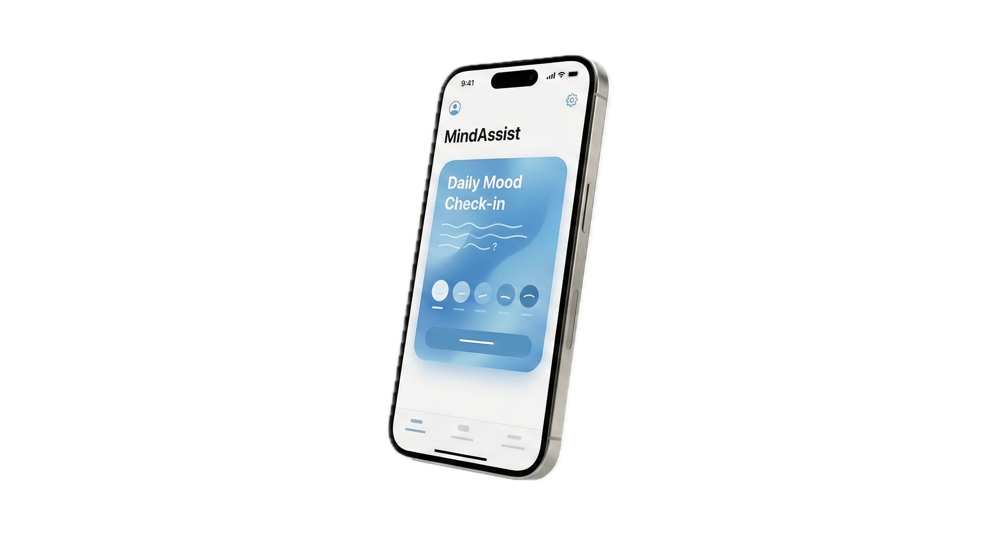

# MindAssist: Sri Lanka's First Tri-Lingual Mental Health Ecosystem 🇱🇰



## 🚨 The Crisis
In Sri Lanka, **22 million people** are served by only a handful of psychiatrists. Cultural stigma, language barriers, and a lack of accessible resources have created a silent epidemic. Existing apps are often English-only and Western-centric, failing to connect with the local context.

## 💡 The Solution
**MindAssist** is a clinically-grounded, culturally-adapted mental health platform designed specifically for the Sri Lankan demographic. It bridges the gap between professional care and the general public through accessible technology.

### 🌟 Key Features
* **Tri-Lingual NLP:** Fully functional support in **English, Sinhala, and Tamil**.
* **Clinical Screening:** Integrated **PHQ-9 (Depression)** and **GAD-7 (Anxiety)** assessments to provide accurate initial screening.
* **SOS Protocol:** One-tap connection to the **1926 National Mental Health Helpline** with location-based hospital mapping.
* **Modified CBT:** Cognitive Behavioral Therapy exercises adapted for Sri Lankan societal norms.
* **Privacy First:** Anonymous peer support and strictly local data handling.

## 🛠️ Tech Stack
Built with the latest modern web technologies for performance and scale.

* **Framework:** [Next.js 16](https://nextjs.org/) (App Router)
* **Language:** [TypeScript](https://www.typescriptlang.org/)
* **Styling:** [Tailwind CSS](https://tailwindcss.com/)
* **Animations:** [Framer Motion](https://www.framer.com/motion/)
* **Icons:** [Lucide React](https://lucide.dev/)
* **Deployment:** Google Firebase Hosting (Static Export)

## 🚀 Getting Started

First, clone the repository:

```bash
git clone [https://github.com/Jayashan-b/mindassist-live.git](https://github.com/Jayashan-b/mindassist-live.git)
cd mindassist-live

```

Install dependencies:

```bash
npm install

```

Run the development server:

```bash
npm run dev

```

Open [http://localhost:3000](https://www.google.com/search?q=http://localhost:3000) with your browser to see the result.

## 🎓 Research & Academic Context

This project was developed as part of a research initiative at the **Informatics Institute of Technology (IIT)** in collaboration with the **University of Westminster**.

**Research Team:**

* **Jayashan Bandara**
* Maneesha Rupasinghe
* Vidunadi Perera
* Thimisha Samarasinghe
* Isuri Apsara
* Kasuni Kavindi

**Foundational Advisor:**

* **Dr. Ravimal Galappaththi** (Consultant Psychiatrist)

---

*© 2025 MindAssist Research Group. All Rights Reserved.*